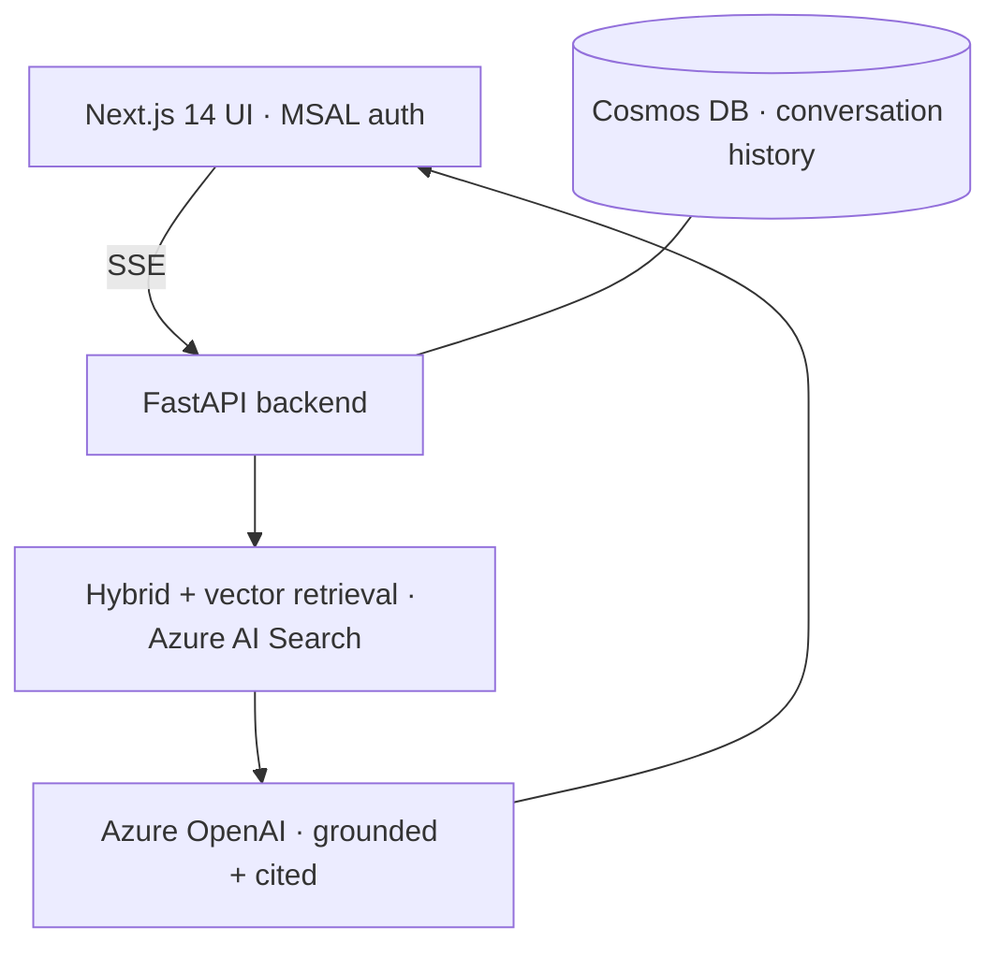

# RAG Chatbot — Next.js + FastAPI + Azure OpenAI

> A production-style, full-stack RAG chatbot: a **Next.js 14** front end and a **FastAPI** backend that streams grounded, citation-backed answers over your documents, with conversation history in Cosmos DB.

   

## What this project is
An end-to-end chat application you can point at a document corpus to get a grounded assistant with a clean, unbranded UI. It demonstrates the full stack an enterprise RAG product needs: retrieval, streaming generation, citations, auth, and persistence.

## What it actually does (implemented)
- **Streaming answers** over Server-Sent Events (token-by-token) with a typing indicator.
- **Grounded responses with clickable citations** — each answer links to the source document/page; a slide-out **PDF viewer** opens the cited page.
- **Conversation history** persisted in **Azure Cosmos DB** (with an in-memory fallback).
- **Microsoft Entra ID (MSAL) authentication** and per-user conversation isolation.
- **Hybrid + vector retrieval** via Azure AI Search; **Azure OpenAI** generation.
- Dark mode, markdown rendering, conversation rename/delete, health endpoint.

## Architecture


## Run it
```bash
# backend
cp .env.example .env         # fill Azure OpenAI / AI Search / Cosmos values
pip install -r backend/requirements.txt
uvicorn app.main:app --reload           # http://localhost:8000
# frontend
cd frontend && npm install && npm run dev   # http://localhost:3000
```
Needs Azure OpenAI, Azure AI Search, and (optional) Cosmos DB resources. See `DEPLOYMENT.md`.

## Tech stack
Next.js 14 · React 18 · TypeScript · FastAPI · Azure OpenAI · Azure AI Search · Azure Cosmos DB · MSAL.

---
